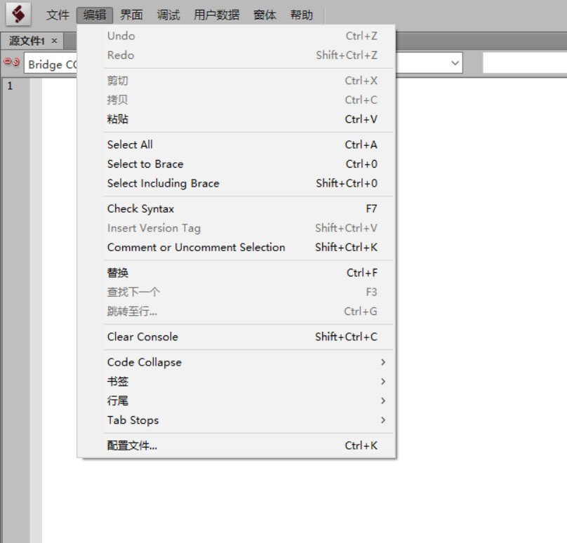

# ESTK_CN
In this item ,I want to translate ESTK interfaces UI into Chinese.Help more users use native language.
  
Need some others can hele me to finish this work together.
  
在这里，我想把ESTK的界面翻译成中文界面，以便帮助更多国人朋友使用ESTK。
  
替换方法 ：
  
STEP: 1
  
下载两个DAT文件到目录 64位系统
C:/Program Files(x86)/Adobe/estk/requried/
  
STEP: 2
  
开启ESTK，语言选择中文即可

STEP: 3
 
效果如下图
翻译不是很完整，期待更多朋友加入
